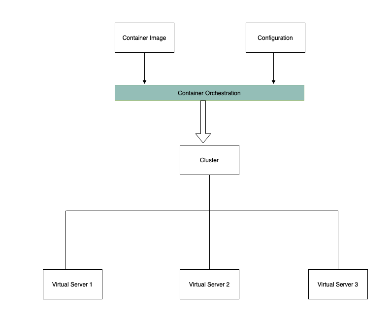
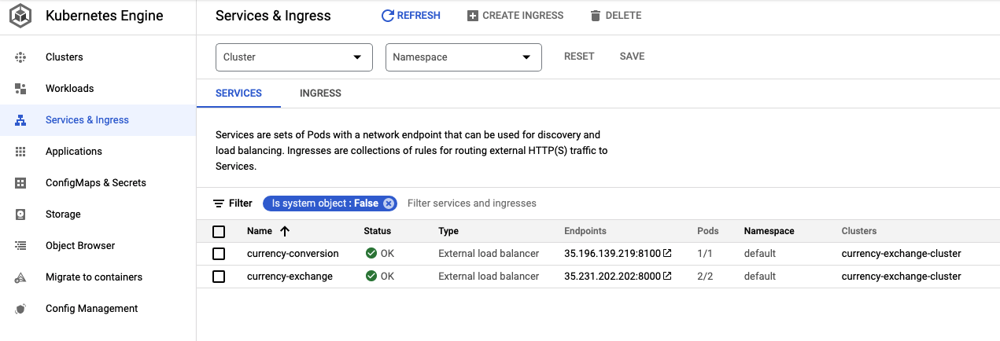
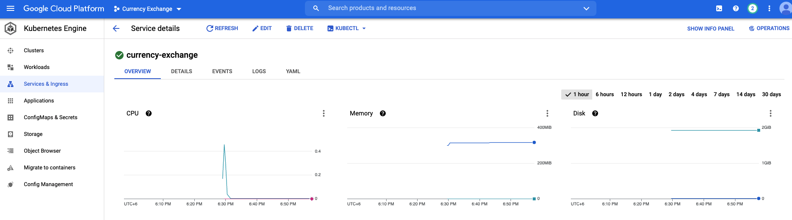
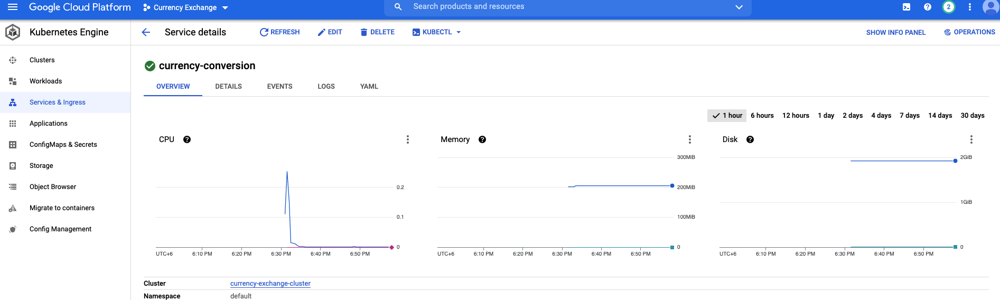

# SPRING CLOUD MICRO-SERVICES
 
 
 

Client-side service discovery allows services to find and communicate with each other without hard-coding hostname and port. The only ‘fixed point' in such an architecture consists of a service registry with which each service has to register.

A drawback is that all clients must implement a certain logic to interact with this fixed point. This assumes an additional network round trip before the actual request.

With Netflix Eureka each client can simultaneously act as a server, to replicate its status to a connected peer. In other words, a client retrieves a list of all connected peers of a service registry and makes all further requests to any other services through a load-balancing algorithm.

 
 

### TYPES OF MICRO-SERVICES 
 
 

We've implement the following types of microservices to achieve the goal:

- Service registry (Eureka Server) 
- REST service which registers itself at the registry (Eureka Client)
- Web application, which is consuming the REST service as a registry-aware client (Spring Cloud Netflix Feign Client)
- Spring cloud gateway that provides means for routing requests to different micro-services 

 
 

figure: Currency Exchange Micro-services
 
 
 

figure: Eureka Server 
 
 
 

figure: Zipkin Server 
 
 
 

 
 

 
 
figure: RABBITMQ Server 
 
 
 

CLINENT REQUESTS

a. API GATEWAY

    http://localhost:8765/currency-conversion/from/USD/to/BDT/quantity/100
    http://localhost:8765/currency-conversion-new/from/USD/to/BDT/quantity/100

    http://localhost:8765/currency-exchange/from/AUD/to/BDT

b. 
    http://localhost:8000/currency-exchange/from/AUD/to/BDT
    http://35.231.202.202:8000/currency-exchange-feign/from/AUD/to/INR

c.     
    http://localhost:8100/currency-conversion/from/USD/to/BDT/quantity/100
    
    http://35.196.139.219:8100/currency-conversion-feign/from/USD/to/INR/quantity/100
    http://35.196.139.219:8100/currency-conversion-feign/from/USD/to/INR/quantity/100

 
 
 

# DOCKER CONTAINERS EXECUTION

 
 

 
 

## RUN WITH THE COMMANDS 

 
 

The follwing commands with create the docker imaages and run all the required micro-services - 

 

    $ ./create_docker_images.sh
    $ docker-compose up

 
 
 

# CONTAINER ORCHESTRATION WITH KUBERNETES 
 
 
 

Typical features:

- Auto Scaling 
- service Discovery
- Load Balancer 
- Self Healing
- Zero Downtime Deployments 

 
 
 

### GOOGLE KUBERNETES ENGINE  (GKE)

 

figure: horizontal deployment architecture
 
 

 

figure: list of the services
 
 

 

figure: Currency exchange service dashboard
 
 

 

figure: Currency conversion service dashboard
 
 
 

